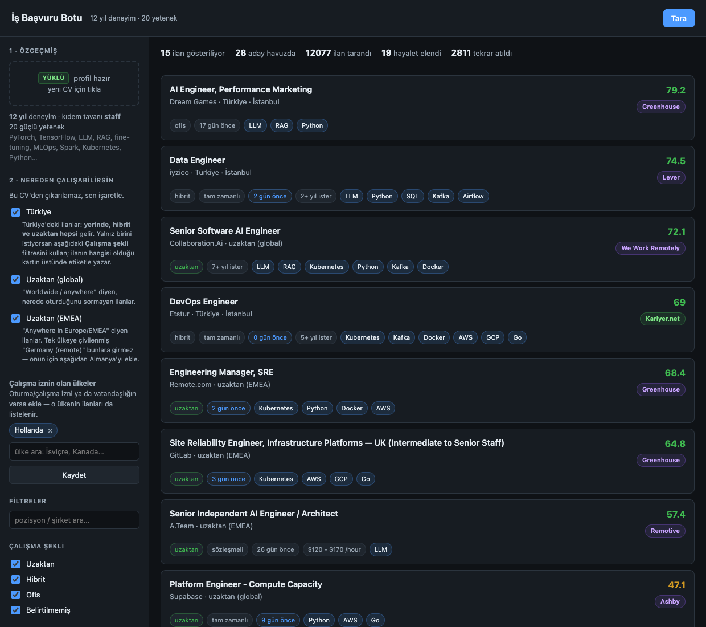

# is-basvuru-bot

CV'nizi alır, şirketlerin **herkese açık ilan API'lerinden** iş ilanı toplar, CV'nize
göre puanlar, **hayalet ilanları** ayıklar ve gerekçeli bir kısa liste çıkarır.

Kişiye özel değildir: motor tamamen `config/profile.yaml` güdümlüdür, kendi CV'nizle
çalışır. Profil dosyasını CV'nizden otomatik üretebilirsiniz. Yazılım dışı meslekler
de kapsanır — sağlık, hukuk, inşaat, muhasebe, lojistik, gıda, enerji, eğitim,
turizm, satış, tekstil, kimya, madencilik, denizcilik ve savunma sanayii dâhil.

İki arama kipi vardır:

- **Hızlı arama** — sözlük ve kural motoru. Yetenek, rol ailesi, kıdem ve konum
  eşleşmesine bakar. Açıklanabilir: her puanın gerekçesi yazılır.
- **Gelişmiş arama** — buna ek olarak **yerel bir model**, ilanın gerçekten sizin
  işiniz olup olmadığını anlam düzeyinde denetler. İnternet gerekmez, CV ve ilan
  metni makineden çıkmaz.

```bash
git clone https://github.com/berketez/is-basvuru-botu.git
cd is-basvuru-botu
./calistir.sh            # Windows: bkz. "Kurulum" başlığı
```

`calistir.sh` kendi izole ortamını kurar (sistem Python'ına dokunmaz), eksik
paketleri yükler ve paneli açar. Başka bir şey kurmana gerek yok.

## Neden scraping / bot yok

Bu araç LinkedIn, Kariyer.net gibi platformlara **otomatik istek atmaz** ve bot
korumalarını atlatmaya çalışmaz. Sebebi pratik: o platformlarda oturum açmış bir hesapla
otomasyon yapmak hesabın askıya alınmasıyla sonuçlanır ve iş arayan biri için bu
kaybedilecek en pahalı şeydir.

Onun yerine **ön kapıdan** girer:

- **İlanlar çoğunlukla platformlara ait değildir.** Şirket Greenhouse/Lever/Ashby/Workable
  kullanıyorsa, ilan o sistemin **kimlik doğrulaması istemeyen, herkese açık JSON ucunda**
  durur. Atlatılacak koruma yoktur; o uçlar okunmak için vardır. Üstelik scraping'den
  iyidir: yapılandırılmış veri, HTML değişince kırılmaz.
- **Platforma özel ilanlar için** platformun kendi **iş alarmı e-postaları** kullanılır
  (kullanıcı alarmı kurar, platform ilanı kendisi gönderir, araç kullanıcının kendi gelen
  kutusunu okur). *Henüz yazılmadı — yol haritasında.*
- **Başvurunun kendisi** API ile mümkün değildir; Greenhouse'un başvuru ucu işverenin
  anahtarını ister. Dolayısıyla başvuru, formu doldurup **son "gönder" tıklamasını
  kullanıcıya bırakarak** yapılır. *Henüz yazılmadı — yol haritasında.*

## Kurulum

Gereken tek şey **Python 3.10+**. Üç yol var; sırayla dene.

### 1) Önerilen — `./calistir.sh`

```bash
./calistir.sh
```

Ne yapar: Python sürümünü denetler → `.venv/` içinde izole ortam kurar →
eksik paketleri yükler → paneli açar. Sistem Python'ına **hiçbir şey yazmaz**.
İkinci çalıştırmada kurulum adımlarını atlar, doğrudan açılır.

Windows'ta (PowerShell):

```powershell
python -m venv .venv
.venv\Scripts\pip install -r requirements.txt
.venv\Scripts\python -m isbot panel
```

### 2) Elle — kendi ortamını yönetiyorsan

```bash
pip install -r requirements.txt
python -m isbot panel
```

### 3) Çift tıklanan uygulama (.app) — macOS

Terminal görmek istemiyorsan:

```bash
pip install -r requirements-paket.txt      # pyinstaller dahil
./kur.sh
```

Uygulama `~/Applications/IsBasvuruBotu.app` altına kurulur, derleme çıktısı silinir,
sistemde tek kopya kalır. Çift tıkla: yerel sunucu açılır, tarayıcı kendiliğinden gelir.

- Veriler `~/is-basvuru-bot/` altında tutulur (profil, veritabanı, çıktılar).
- Sunucu **yalnızca 127.0.0.1**'e bağlanır; ağdaki başka makineler erişemez.
- CV makineden hiç çıkmaz.
- **Kapatmak:** Dock simgesine sağ tık → Çık. Sunucu da kapanır.
- Zaten açıkken simgeye tıklamak ikinci sunucu başlatmaz, panel sekmesini geri açar.
- **Bir şey ters giderse:** Finder'dan açılan uygulamanın terminal çıktısı yoktur;
  her şey `~/Library/Logs/IsBasvuruBotu.log` dosyasına yazılır. Önce oraya bak.

macOS notu: paket ad-hoc imzalanır. Başka bir makineye kopyalarsan Gatekeeper uyarır;
kullanıcı sağ tık → Aç demeli. Sorunsuz dağıtım için Apple geliştirici sertifikası +
notarization gerekir (yıllık ücretli).

### Sistem bağımlılığı: `pdftotext` (önerilir)

PDF'ten metin çıkarmanın **asıl** yolu poppler'ın `pdftotext` aracıdır; sütunlu
CV'lerde pypdf'ten belirgin biçimde daha iyi sonuç verir. Yoksa araç `pypdf`'e düşer
ve çalışmaya devam eder — ama iki kolonlu bir CV'de metin karışabilir.

```bash
brew install poppler                 # macOS
sudo apt install poppler-utils       # Debian / Ubuntu
```

Windows: <https://github.com/oschwartz10612/poppler-windows> (indir, `bin/` klasörünü PATH'e ekle)

## Kullanım (komut satırı)

```bash
# 1) CV'nizden profil taslağı üretin (PDF / TeX / DOCX / MD / TXT)
python -m isbot cv-import ~/cv.pdf -o config/profile.local.yaml

# 2) Taslağı gözden geçirin — özellikle: calisma_izni, zorunlu_konum_kosulu, max_kidem
#    (bunlar CV'den güvenilir biçimde çıkarılamaz)

# 3) Tarayın
python -m isbot tara --min-puan 25 -n 25

#    Uyum hakemiyle (yerel model; ilanın gerçekten sizin işiniz olup olmadığını denetler)
python -m isbot tara --gelismis -n 25

# Yardımcılar
python -m isbot dogrula greenhouse anthropic   # bir ATS anahtarını sına
python -m isbot durum                          # veritabanı istatistikleri
python -m isbot panel                          # web panelini aç
```

Çıktı: terminalde tablo + `out/ilanlar-<tarih>.md` içinde her ilan için gerekçe
(hangi yetenekler eşleşti, neyi tutturamıyorsunuz, konum neden uygun, ilan kaç günlük).

## Gelişmiş arama (uyum hakemi)

Motor sözcüğe bakar, anlama bakmaz. İki tipik kırılma ölçüldü:

- Türkçede **"kontrol"** hem *control systems* hem *quality control* demek.
  kariyer.net'te "kontrol mühendisi" sorgusunun 51 sonucunun **tamamı** kalite
  kontrol / kontrol odası ilanıydı.
- CV'sinde "AutoCAD sertifikalı" yazan bir kontrol mühendisi adayına
  **"CAD/CAM Operatör Yardımcısı"** ilanı 50,2 puanla kısa listenin ikinci
  sırasından geldi. Başlık kalıbı tutuyor, yetenek tutuyor — ama iş adaya ait değil.

Gelişmiş arama bu kararı anlam düzeyinde verir: adayın **ne olduğunu** ve **ne
olmadığını** anlatan iki cümle kurulur, ilan ikisine de kıyaslanır, fark alınır.
Yalnız "uygun mu" diye sormak yetmiyordu; "kalite kontrol mühendisi" ilanı da
adaya benziyor. Ayrımı yaratan, adayın işi *olmayan* mesleklere olan yakınlığın
düşülmesi.

**Model elemez.** Kendisi de yanılıyor (ölçümde bir pazarlama ilanına olumlu skor
verdi). Bu yüzden yalnız puanı dar bir bantta (±%18) düzeltir ve şüpheli bulduğunu
`uyum şüpheli` etiketiyle işaretler. Eleme kararı motorun sert filtrelerinde kalır.

Ölçülen (14 Eyl 2026):

| | Yalnız motor | Gelişmiş arama |
|---|---|---|
| 10.834 ilan, 12 CV, alan isabeti | 52/60 | **54/60** |
| Kötüleşen CV | — | **0** |

Türkçe karışık havuzlarda fayda daha yüksek: savunma sanayii havuzunda CAD/CAM
operatör ilanları negatife düştü, mühendislik ilanları pozitif kaldı.

**Teknik:** çok dilli cümle gömme modeli (118M parametre), ONNX int8 — ~113 MB
model + 16 MB sözlükleyici. PyTorch **gerekmez**. Model `.app` içine gömülür;
kaynaktan çalıştırırken `./calistir.sh --model-indir` ile bir kez indirilir.
Yoksa panelde gelişmiş seçeneği hiç görünmez, motor eskisi gibi çalışır.

**Zayıf donanım:** en çok 400 ilan denetlenir ve denetim 90 saniyeyi aşarsa kalanı
bırakılır. Denetlenmeyen ilan **kaybolmaz** — motorun kendi puanıyla listede kalır.
Model dosyası donanıma özel değildir (genel int8; AVX512'ye bağlı sürüm bilerek
kullanılmadı).

## Hayalet ilan tespiti

Hayalet/havuz ilanı ("talent pool", yıllardır açık duran kadro) tespiti iki grup
sinyale dayanır. İlk koşuda yalnızca birinci grup çalışır; araç düzenli koştukça
veritabanı büyür ve tespit keskinleşir.

**Anında:** ilan yaşı (>1 yıl, >2 yıl, >3 yıl kademeleri) · "talent pool / expression of
interest / genel başvuru" kalıpları · "ileride açılacak pozisyonlar için" ifadeleri ·
konum enflasyonu · yayın tarihinin hiç verilmemesi

**Zamanla (≥2 koşu):** *sahte tazeleme* — güncelleme tarihi ilerlemiş ama ilan metni
harfi harfine aynı · *yeniden yayım* — aynı başlık kapanıp yeni kimlikle açılmış ·
hiç kapanmama

## Arayüz



İş sitelerinin standart filtreleri var: arama, **çalışma şekli** (uzaktan/hibrit/ofis),
**istihdam türü** (tam zamanlı/yarı zamanlı/sözleşmeli/staj), yayın tarihi, en az
uygunluk puanı, şirket ve **hayalet ilan** bandı. Bir karta tıklayınca gerekçe açılır:
hangi yetenekler eşleşti, neyi tutturamıyorsun, konum neden uygun, tazelik sinyalleri.

Çalışma şekli ve istihdam türü ATS'ler bunu tutarsız verdiği için türetilir
(Greenhouse hiç vermiyor). Çıkarılamıyorsa **"belirtilmemiş"** yazar — uydurulmaz.

**Nereden çalışabilirsin** adımı CV'den çıkarılamaz, elle işaretlenir: Türkiye, uzaktan
(global), uzaktan (EMEA) ve **çalışma izninin olduğu ülkeler**. Ülke listesi sabit
değildir; motorun tanıdığı ülkeler `/api/ulkeler` ucundan gelir ve arayüzde aranıp
eklenir (İsviçre, Kanada, Hollanda…). Ülke eklemek için tek yer düzenlenir:
`isbot/scoring.py` içindeki `ULKELER` kataloğu — arayüz kendiliğinden güncellenir.

Türkiye işaretliyken ülke içindeki ilanların **hepsi** gelir: yerinde, hibrit, uzaktan.
Hangisi olduğu kartın üstünde etiketle yazar; yalnız birini istiyorsan **çalışma şekli**
filtresi kullanılır. Konum satırı yalnız şehir içeriyorsa ("Zurich", "Berlin") ülke
şehirden çözülür; çözülemeyen kapsam **uygun sayılmaz** (fail-closed).

## Kaynaklar

**Şirket başına** (anahtar = ATS'teki şirket token'ı): Greenhouse, Lever, Ashby,
Workable, SmartRecruiters.

**Şirketler-arası** (anahtar = arama sorgusu ya da tüm akış): Remotive, RemoteOK,
**Arbeitnow** (Almanya/AB, tüm sektörler), **The Muse** (ABD, tüm sektörler, kıdem
bilgisini kendisi veriyor), **Himalayas** (son geçerlilik tarihi + maaş), **Jobicy**,
**We Work Remotely**.

**Türkiye** (HTML, robots.txt'ye uyumlu, iki aşamalı): **Kariyer.net**, **Eleman.net**. Bunlar önemli çünkü
Greenhouse/Lever/Ashby'nin şirketler-arası indeksi yoktur — her şirketi tek tek eklemek
gerekir. Toplayıcılar tek istekte yüzlerce şirketi tarar. Remotive'in
`candidate_required_location` alanı ("Worldwide", "USA Only") ilanın kendi beyanıdır;
konumu metinden çıkarmaktan çok daha güvenilir.

## Şirket listesi

`config/companies.yaml` — 74 şirket, anahtarların tamamı canlı doğrulanmış.

**Yeni şirket eklerken kimliği teyit edin.** Anahtar tahmini sahte eşleşme üretir:
doğrulama sırasında `greenhouse/peak` Teksas'ta bir fizik tedavi kliniği,
`greenhouse/insider` ABD'li bir haber sitesi çıktı. `python -m isbot dogrula <kaynak>
<anahtar>` komutu ilan konumlarını da basar; oradan teyit edin.

Anahtarı bulmak: şirketin kariyer sayfası URL'sinin son kısmı —
`job-boards.greenhouse.io/ANAHTAR`, `jobs.lever.co/ANAHTAR`,
`jobs.ashbyhq.com/ANAHTAR`, `apply.workable.com/ANAHTAR`.

### Türkiye kapsamı hakkında dürüst not

Türk şirketlerinin büyük kısmı kariyer.net veya kendi sistemleri üzerinden ilan verir ve
herkese açık API'leri yoktur. Yalnızca uluslararası ölçekte çalışanlar Lever/Greenhouse
kullanır (Trendyol, Dream Games, Peak Games, iyzico, Midas, Picus, Intenseye doğrulandı).

**Savunma sanayii ve havacılık** için ayrı bir kanal var. ASELSAN, TUSAŞ, ROKETSAN gibi
kurumların herkese açık ATS ucu yoktur ve bir kısmının kendi sitesi bot korumasının
arkasındadır — o kapılar zorlanmaz. Bunun yerine kariyer.net'in **sektör sayfaları**
kullanılır (`/is-ilanlari/savunma+sanayi`, `/is-ilanlari/havacilik`): bunlar sitenin
kendi sitemap'inde ilan ettiği, robots-izinli kanonik yollardır ve o sektördeki
şirketlerin ilanlarını tek sayfada verir. Rol ailesi "havacılık/savunma" veya
"kontrol/otomasyon" olarak tespit edilen profillerde bu sorgular otomatik eklenir.

Ölçüldü (14 Eyl 2026): bu iki sorgu 152 ilan getirdi; içinde ASELSAN, ASİSGUARD, TEDEG,
MENATEK, Lentatek ve Leonardo Turkey vardı. Sektör sayfası olduğu için karışık gelir
(operatör, idari, üretim ilanları da dâhil) — ayıklama puanlamaya bırakılır.

**Sınır:** bu kurumların ilanlarının tamamı kariyer.net'e düşmez; bir bölümü yalnız kendi
kariyer portallarında durur. Araç onları göremez ve göremediğini söyler.

#### Kapsam nasıl genişletiliyor

Ölçüldü (14 Eyl 2026): bir taramada 12.154 ilanın %82'si yabancı ATS'lerden geliyordu
(Greenhouse 5.694, Ashby 2.064) ama kariyer.net'ten yalnız **329** ilan alınıyordu —
oysa kısa listedeki 124 ilanın **122'si** o panodandı. En değerli kaynak en dar olanıydı.

Sebep: sorgu başına yalnız en iyi 2 kategori sayfası çekiliyordu ve kariyer.net kategori
sayfaları **sayfalanmıyor** (sitemap'in 60.441 yolunda tek bir sayfa parametresi yok);
her sayfa ilk ~50 ilanı veriyor. Üç değişiklik yapıldı:

- **İl çeşitliliği.** Sitemap aynı pozisyonun il bazlı sayfalarını ilan ediyor
  ("otomasyon mühendisi" için 125, "savunma sanayi" için 74 yol) ve bunlar *farklı*
  ilanlar taşıyor. Sorgu başına 4 yol alınır; ülke geneli sayfa her zaman dâhil,
  aynı ilden ikinci yol alınmaz, iller iş hacmine göre önceliklidir (Kırıkkale ve
  Eskişehir listede yüksek — MKE ve TUSAŞ orada).
- **Sektör sayfaları.** Pozisyon sorgusu yalnız o unvanı getirir; sektör sayfası
  (`otomasyon`, `bankacilik`, `gida`) o sektördeki *tüm* firmaların ilanlarını verir.
  Bu sayfalar **elle listelenmez, sitemap'ten türetilir**: şehirsiz + unvan eki
  taşımayan + en çok 3 sözcüklü + *altında en az 3 pozisyon yolu bulunan* yollar.
  İkinci kural şart — onsuz "makine+enspektoru" gibi unvanlar sektör sanılıyor, ve
  unvan eki listesini büyütmek çözüm değil, sonsuz elle bakım demek. Hâlen 143 sektör
  türetiliyor; site yeni bir sektör açarsa kod değişmeden gelir.
- **Firma profili (isteğe bağlı).** Bir kuruma odaklanmak isteyen kullanıcı
  `tr_hedef_sirketler` listesine şirket adı yazar; o şirketin kariyer.net firma profili
  taranır (`firma:ASELSAN`). Varsayılan **boştur**: Türkiye'de binlerce banka, sigorta,
  otomotiv ve fabrika var, elle şirket listesi tutmak ölçeklenmiyor — sektör sayfaları
  aynı işi ölçeklenebilir yapıyor.

**Google üzerinden çekilebilir mi?** Denendi, bu iş için çalışmıyor. Google'ın arama
sonuçlarını kazımak zaten yapılmıyor (ToS ihlali, CAPTCHA, IP yasağı — LinkedIn'e
girmeme sebebiyle aynı). Resmî Programmable Search API meşrudur ama kullanıcıdan kendi
anahtarını ister ve günde 100 sorgu = 1.000 sonuç tavanı vardır; doğrudan pano
taramasından *daha az* verimlidir. Tek avantajı bot korumalı siteler olurdu — ama
ölçüldü: ASELSAN'ın kendi kariyer portalı **Google'da da indeksli değil**, aramada
yalnız haber siteleri ve iş ilanı toplayıcıları çıkıyor.

> **Doğrulama notu:** bu üç değişiklik çevrimdışı (sitemap üzerinde) doğrulandı ve
> tüm testler geçiyor, ama **canlı tarama ile sınanmadı** — geliştirme sırasında üst
> üste gelen istekler panodan 6 saatlik engel getirdi. Kod güvenli başarısız oluyor:
> yol bulunamazsa boş liste, sayfa yapısı farklıysa 0 kart döner, tarama normal devam
> eder. Gerçek kapsam artışı (329 → ?) ölçülmeyi bekliyor.

## Türk panoları ve nezaket kuralları

kariyer.net ve eleman.net'ten ilan okunur. Bu panolarda herkese açık API yoktur,
dolayısıyla HTML okunur — ama yapılan şey **nazik tarama**dır, atlatma değil:

- `robots.txt` her koşumda okunur ve **programatik uygulanır**. kariyer.net'te
  `/filtre/*`, `/servisler/`, `/ozgecmis/*` yasaktır; o yollara hiç gidilmez.
- İstek aralığı **4 saniye** ve zaman damgası **diske yazılır**. Süreç-içi sayaç
  yetmez: ard arda çalışan betikler sayacı sıfırlar, gerçek hız yükselir.
  (Ölçüldü: geliştirme sırasında bu yüzden 403 yendi.)
- 403/429 alınırsa o panoya **6 saat dokunulmaz**. Israr engeli uzatır.
- CAPTCHA çözme, parmak izi sahteciliği, IP değiştirerek engeli dolanma **yoktur**.
  Engel yendiyse doğru davranış beklemektir; VPN ile devam etmek, sitenin koyduğu
  sınırı kasten dolanmak olur ve aracı kullanan herkesi riske atar.

### Geliştirirken canlı siteye istek atma

> Bu kural ciddiye alınmalı: 14 Eyl 2026'da ham `curl` denemeleri, botun kendi taraması
> ve detay çekimi aynı gün üst üste gelince kariyer.net **6 saatlik engel** verdi.
> Ayrıştırıcı değişiklikleri `ISBOT_ORNEK=oku` ile kayıtlı örnekler üzerinde sınanmalı.

Ayrıştırıcı üzerinde çalışırken kayıtlı sayfa örnekleri kullanılır:

```bash
ISBOT_ORNEK=kaydet python -m isbot tara    # çekilen sayfaları tests/ornekler/ altına yaz
ISBOT_ORNEK=oku    python tests/test_regresyon.py   # ağa hiç çıkmadan ayrıştırıcıyı sına
```

Regresyon testi bu modu kullanır ve soketi kapatarak ağa çıkılmadığını doğrular.

## Benchmark

```bash
tests/hepsi.sh                       # hepsi: regresyon + benchmark + kesinlik
python tests/benchmark.py --yenile   # havuzu yeniden çek
```

Üç test takımı var:

| Takım | Ne ölçer | Ağ |
|---|---|---|
| `test_regresyon.py` | Düzeltilen 26 hatanın geri gelmemesi (101 kontrol) | yok |
| `benchmark.py` | 15 CV'nin ayrıştırılması + eleme/konum/negatif kontrol (105 kontrol) | önbellek |
| `kesinlik.py` | **Her CV'nin ilk 10 sonucunda alan dışı ilan sayısı — hedef 0** | önbellek |

`tests/ornekler/` (Türk panolarından kaydedilmiş sayfa örnekleri) **depoda yoktur** —
üçüncü tarafa ait içerik, yerelde kalır. O örneklere bağlı beş kontrol dosyalar yoksa
sessizce atlanır, kalan 96 kontrol ağa hiç çıkmadan koşar.

15 sahte CV (farklı sektör ve seviye) iki katmanda sınanır. Beklentiler
`tests/beklenen.yaml` içinde **elle** yazılmıştır — motorun çıktısına bakılarak değil,
CV'ler okunarak. Döngüsel doğrulamayı önlemek için sıra budur.

**A) Yapısal** — deneyim yılı (±1,5 tolerans), kıdem tavanı, tespit edilmesi gereken
yetenekler, tespit edilmemesi gereken yetenekler (yanlış pozitif). Son durum: **15/15**.

**B) Alaka** — tek ilan havuzu 15 profile karşı puanlanır; ilk 5 sonuçta kendi eleme
kalıbına uyan başlık geçmiş mi (sızıntı), konum uygunluğu bozulmuş mu, alan anahtar
kelimeleri tutuyor mu. İki de **negatif kontrol** var: makine mühendisi yeni mezun bu
yazılım havuzundan neredeyse hiç sonuç almamalı (1 aday alıyor).

Son koşu: `docs/benchmark-sonuc.txt`.

### Türk panoları ve nezaket kuralları

kariyer.net ve eleman.net'ten ilan okunur. Bu panolarda herkese açık API yoktur,
dolayısıyla HTML okunur — ama yapılan şey **nazik tarama**dır, atlatma değil:

- `robots.txt` her koşumda okunur ve **programatik uygulanır**. kariyer.net'te
  `/filtre/*`, `/servisler/`, `/ozgecmis/*` yasaktır; o yollara hiç gidilmez.
- İstek aralığı **4 saniye** ve zaman damgası **diske yazılır**. Süreç-içi sayaç
  yetmez: ard arda çalışan betikler sayacı sıfırlar, gerçek hız yükselir.
  (Ölçüldü: geliştirme sırasında bu yüzden 403 yendi.)
- 403/429 alınırsa o panoya **6 saat dokunulmaz**. Israr engeli uzatır.
- CAPTCHA çözme, parmak izi sahteciliği, IP değiştirerek engeli dolanma **yoktur**.
  Engel yendiyse doğru davranış beklemektir; VPN ile devam etmek, sitenin koyduğu
  sınırı kasten dolanmak olur ve aracı kullanan herkesi riske atar.

### Geliştirirken canlı siteye istek atma

Ayrıştırıcı üzerinde çalışırken kayıtlı sayfa örnekleri kullanılır:

```bash
ISBOT_ORNEK=kaydet python -m isbot tara    # çekilen sayfaları tests/ornekler/ altına yaz
ISBOT_ORNEK=oku    python tests/test_regresyon.py   # ağa hiç çıkmadan ayrıştırıcıyı sına
```

Regresyon testi bu modu kullanır ve soketi kapatarak ağa çıkılmadığını doğrular.

## Meslek kapsamı testi

`tests/meslek_kapsami.py` — 16 sentetik CV (8 Türkçe + 8 İngilizce; makine, inşaat,
muhasebe, hemşirelik, teknisyenlik, lojistik, mimarlık, öğretmenlik, kimya, pazarlama)
doğru rol ailesine gidiyor mu? Ağ istemez, saniyeler sürer.

Türkçe CV'ler bilerek **NFD** (ayrıştırılmış Unicode) yazılmıştır — `pdftotext`
gerçeğini taklit eder. Normalizasyon kaldırılırsa testler anında kırmızıya döner.
CV'lerin tamamı uydurmadır, gerçek kişi bilgisi içermez.

```bash
python tests/meslek_kapsami.py
```

## Benchmark'ın ölçmediği şey

"Alan tutması" ham anahtar kelime eşleşmesidir; bir frontend geliştiricisine gelen
"Full-Stack Engineer" ilanı 0/5 sayılır ama makul bir eşleşmedir. Yani alaka sayıları
kaliteyi bir miktar olduğundan kötü gösterir. Havuzda o alan hiç yoksa (mobil, oyun)
motor komşu alandan sonuç getirir ve bunları **"alan dışı"** diye etiketleyip puanını
%45 kırar — böylece alan içi eşleşmelerin altına sıralanır.

## Yol haritası

- [x] ~~Lokal web paneli + `.app` paketleme~~ (`./calistir.sh` tek komut; `./kur.sh` .app üretir)
- [x] ~~15 CV'lik yapısal benchmark~~ (tests/benchmark.py, 112 kontrol)
- [x] ~~Yazılım dışı meslek kapsamı~~ (518 yetenek / 37 rol ailesi; 32 CV'lik
      `tests/meslek_kapsami.py`). **ESCO kullanılmadı:** taksonomide Türkçe yok ve
      "skill" etiketleri fiil öbeği ("operate welding equipment"), bu motorun aradığı
      anahtar sözcük değil. Kalemler elle küratörlendi.
- [x] ~~Gelişmiş arama: yerel uyum modeli~~ (ONNX int8, `.app` içine gömülü)
- [x] ~~Meslekten bağımsız eleme~~ (v1.5.3) — sabit başlık yasakları adayın kendi meslek
      ailesine uygulanmıyor (İK'ya "Recruiter", satışa "Account Executive" açık);
      `roller.yaml`'da İK/İSG kalıplarındaki `\b` YAML'da backspace'e dönüşüyordu.
- [x] ~~Hazır reranker denemesi~~ — **EKLENMEDİ** (2026-10-08). `mmarco-mMiniLMv2` (118M)
      ve `modernbert-tr-reranker` (149M) 48 CV'de (16 test + 32 meslek) motor ve e5
      hakemiyle kıyaslandı: bir grupta +4–5 isabet kazandıran varyant öbüründe 4–7
      kaybettirdi, 2–4 CV kötüleşti. Darboğaz sıralama değil: 48 CV'nin 39'unda motor
      15'ten az aday bırakıyor; model listede olmayanı getiremez.
- [ ] Kıdem kalıbı mid adaylarda "manager" sözcüğünü eliyor — Product/Marketing/Account
      Manager gibi yönetici OLMAYAN unvanlar da gidiyor. Karma profillerde "Engineering
      Manager"ı geri getirmeden çözülmeli.
- [ ] Uyum hakemi yazılım dışı mesleklere uymuyor: profil cümlesi "… deneyimli mühendis"
      diye başlıyor, "uyumsuz meslekler" cümlesi sabit (İK, satış, kalite kontrol adayına
      kendi mesleği yüzünden ceza).
- [ ] **Türkiye kapsamının canlı ölçümü** — il çeşitliliği + sektör sayfaları yazıldı
      ama gerçek tarama ile sınanmadı (pano engeli). 329 → ? ilan ölçülecek.
- [ ] İş alarmı e-postalarından ilan okuma (LinkedIn kapsamı için tek meşru yol)
- [ ] Başvuru hazırlama: ilana özel CV + ön yazı, formu doldur, gönderimi kullanıcıya bırak

## Paket bütünlüğü

Uygulama açılışta zorunlu veri dosyalarını denetler; `GET /api/saglik` sonucu verir.
Derleme sırasında da `assert` ile kontrol edilir — eksik veri dosyasıyla paket
üretilemez. (Bir sürümde `roller.yaml` pakete girmemiş ve rol aileleri sessizce
çalışmamıştı; bu denetim onun tekrarını engelliyor.)

## Platform

macOS, Linux, Windows. Tek platform bağımlısı parça PDF okumadır: `pdftotext` varsa
kullanılır, yoksa `pypdf`'e düşer (ikisi aynı sonucu verir, sınandı).
